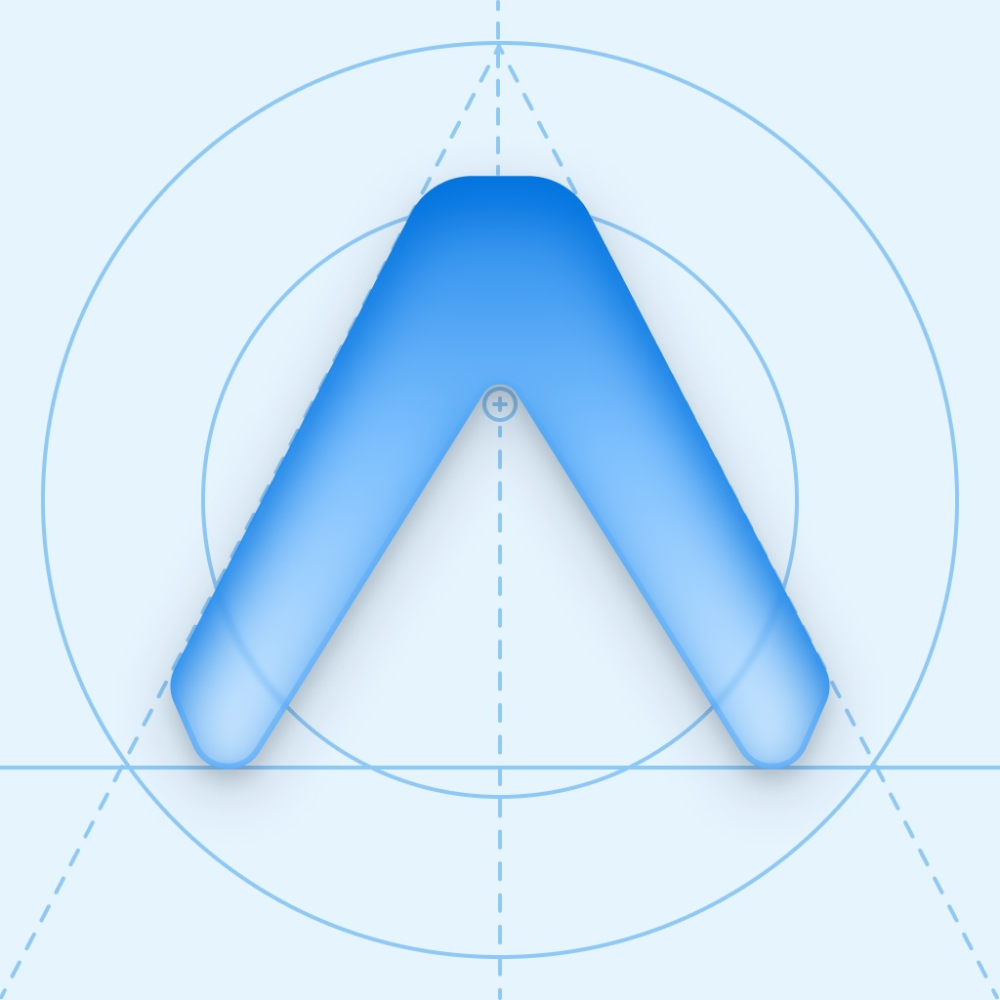

# 📱 Mockup Studio – iPhone 17 Pro Max Mockup Generator

<p align="center">
  
</p>

<p align="center">
  A modern, high-precision iPhone 17 Pro Max device mockup generator built with <b>React Native</b>, <b>Expo SDK 54</b>, and <b>TypeScript</b>.<br/>
  Runs seamlessly on <b>iOS (Expo Go)</b> and in <b>Web Browsers (Safari / Chrome)</b>.
</p>

---

## ✨ Key Features

- **📱 Realistic iPhone 17 Pro Max Frame:**
  - True-to-scale chassis and display geometry with balanced, symmetrical $10\,\text{pt}$ titanium bezels.
  - Concentric corner radii ($58\,\text{pt}$ display / $66\,\text{pt}$ chassis).
  - Silhouetted hardware buttons (Action Button, Volume, Power, Camera Control) and antenna bands.
  - Optional TrueDepth Dynamic Island pill with subtle lens reflection.

- **🎨 8 Titanium Chassis Finishes:**
  - *Space Black, Natural Titanium, White Titanium, Desert Titanium, Deep Blue, Midnight Green, Rose Gold, Silver*.

- **🌸 Soft Pastel & Studio Color Palette:**
  - Curated aesthetic background colors (*Soft Lavender, Pastel Sage, Powder Rose, Warm Peach, Ice Blue, Butter Cream, Slate Gray, etc.*).
  - Custom Hex input support (`#RRGGBB`).

- **🏁 100% Transparent PNG Export:**
  - Clean isolated alpha channel with automatic background & shadow suppression for seamless use in Photoshop, Figma, Canva, and Keynote.

- **🔍 Ultra-HD 9:16 Export Resolution:**
  - Dedicated $540 \times 960\,\text{pt}$ capture canvas rendered at `@3x` ($1620 \times 2880\,\text{px}$) for crisp Retina quality.

- **🌐 Dual Platform Support:**
  - Native iOS experience via **Expo Go** with native PHPicker & Photos saving.
  - Browser support for instant desktop mockup creation and direct PNG downloads.

---

## 🛠️ Tech Stack

| Technology | Purpose |
| :--- | :--- |
| **Expo SDK 54** | Cross-platform framework & tooling |
| **React Native 0.81.5** | Core UI components & layout engine |
| **TypeScript 5.6** | End-to-end type safety |
| **react-native-view-shot** | High-resolution off-screen PNG compositing |
| **expo-image-picker** | Native iOS photo & screenshot picker |
| **expo-media-library & sharing** | iOS Camera Roll saving & system Share Sheet |
| **react-native-web** | Browser compilation & DOM rendering |

---

## 📁 Repository Structure

```
.
├── README.md                    # Project documentation
├── .gitignore                   # Git ignore patterns
└── MockupGenerator/             # Main Expo Application
    ├── App.tsx                  # Root component (layout, state, export pipeline)
    ├── index.ts                 # Expo entry point
    ├── app.json                 # Expo app configuration & permissions
    ├── package.json             # Dependencies and scripts
    └── src/
        ├── config/
        │   └── devices.ts       # Device dimensions & geometry
        ├── types/
        │   └── index.ts         # TypeScript models & interfaces
        ├── utils/
        │   ├── colors.ts        # Pastel background color presets
        │   ├── chassisColors.ts # Titanium chassis finishes & reflections
        │   └── geometry.ts      # Responsive scaling calculations
        ├── components/
        │   ├── MockupCanvas.tsx     # Device mockup renderer & layers
        │   ├── ScreenshotPicker.tsx # Photo selection trigger
        │   ├── ChassisPicker.tsx    # Titanium color selector
        │   ├── BackgroundPicker.tsx # Background & transparency selector
        │   └── ExportButton.tsx     # High-res export CTA with action dialog
        └── services/
            ├── exportService.ts     # Native iOS view-shot capture service
            └── exportService.web.ts # Web Canvas PNG generator & downloader
```

---

## 🚀 Getting Started

### Prerequisites
- **Node.js** (v18 or higher)
- **Expo Go** app installed on your iPhone (iOS 15+)

### 1. Installation
```bash
cd MockupGenerator
npm install
```

### 2. Start the Development Server
```bash
# Start Metro bundler with LAN network access
npx expo start --lan
```

### 3. Open the App
- **In Browser:** Open [http://localhost:8081](http://localhost:8081) in Safari or Chrome.
- **On iPhone:** Scan the terminal QR code with the iOS Camera app to open in **Expo Go**.

---

## 📄 License
This project is licensed under the MIT License.
